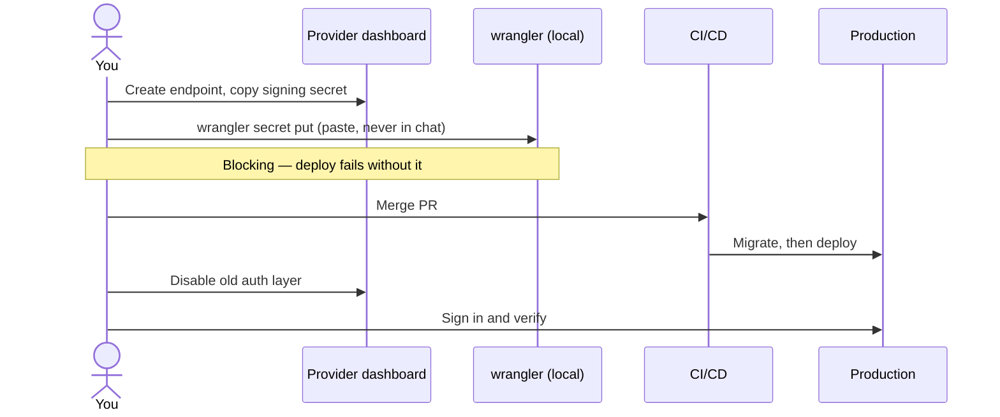
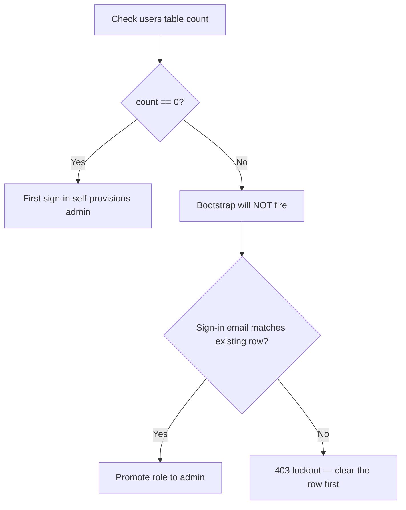

# Handing manual work back to the user

When a task can't be finished without the user acting, the deliverable is a **runbook**, not an
explanation. Prose buries the actions; a numbered list with exact commands doesn't.

## First: verify you actually can't do it

Do this before writing a single step. Claiming something is manual when it isn't wastes the user's
time and erodes trust in the rest of the runbook.

Check, in order:

1. **Is there a CLI already installed and authenticated?** (`wrangler`, `gh`, `clerk`, …) Check its
   `--help` and subcommands rather than assuming.
2. **Is there an API path?** Many CLIs expose a raw escape hatch — `clerk api ls <keyword>`,
   `gh api`. List the endpoints and look.
3. **Is there an MCP tool?** Search rather than guessing at capabilities.
4. **Can a value move file-to-file without passing through the transcript?** Piping stdin
   (`printf '…' | wrangler secret put NAME`) or `grep '^KEY=' src >> dest` keeps secrets out of
   chat while still letting you do the work.

Only after those come up empty is a step genuinely manual. State *which* reason applies:

| Reason | Example |
|---|---|
| Browser-only, no API exists | Reading a webhook signing secret out of an embedded Svix dashboard |
| Account identity / signup | Creating an account tied to the user's own email |
| Credential the user holds | A value that only ever exists in their browser |
| Destructive on production | `DELETE FROM`, dropping a resource, disabling live auth |
| Permission-gated | A tool call the harness refused |
| User's call to own | Live DNS records, flipping production traffic |

If you got a capability wrong earlier in the conversation, correct it plainly and re-draw the split.

## Runbook format

- **Numbered, in execution order.** One action per step.
- **Exact copy-pasteable commands**, with the working directory stated once at the top.
- **Say what's already done** so nothing gets redone.
- **Mark blocking vs parallel** — which steps gate your next move, which can happen anytime.
- **Say where to report back**, and what you need back (a value, a yes/no, an error message).
- **Never route secrets through chat.** Public identifiers (a publishable key, a resource ID) are
  fine. For anything credential-like, have them pipe it: `wrangler secret put NAME` prompts, they
  paste, it never enters the transcript.
- **Flag traps before the step, not after.** If a wrong choice at step 4 causes a lockout at step 7,
  that warning belongs at step 4.
- **Drop terse/compressed phrasing.** Ordered sequences where a misread has consequences get written
  out normally.

## Diagrams

Include a mermaid diagram when the *shape* of the flow is the thing that's hard to hold in your
head — not as decoration. Skip it for three linear steps.

Worth diagramming:

- Work crossing several systems where handoff order matters
- A cutover where two things can't be live at once
- Anything with a lockout or data-loss path

**Sequence diagram** — for multi-system handoffs:

**Flowchart** — for branch points and traps:

Keep labels short; mermaid renders poorly with long text in nodes.

## Closing the loop

End with what happens after they finish: what you'll do next, and what to send you if a step fails.
If a later step can't be planned until an earlier answer arrives, say so rather than inventing the
rest of the sequence.
