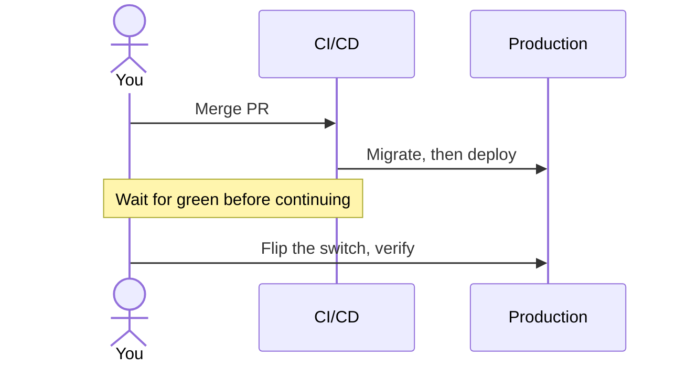
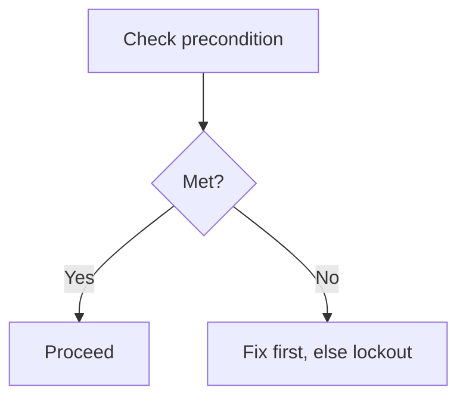

# Handing manual work back to the user

When a task can't be finished without the user acting, the deliverable is a **runbook written to a
file**, not a chat message.

## Write it to a file — this is the point of the skill

**Always `Write` the runbook to `docs/runbooks/<short-slug>.md`.** Never paste the steps into the
chat response.

Why: this runs in a terminal. Mermaid diagrams don't render there, long numbered lists scroll away,
and the user can't keep the steps open beside a dashboard while working. A `.md` file opens in the
editor's markdown preview with diagrams rendered and steps that stay put.

Your chat reply should be **two or three lines only**:

- a markdown link to the file, e.g. `[docs/runbooks/clerk-cutover.md](docs/runbooks/clerk-cutover.md)`
- a note to open the preview (VS Code: `Ctrl+Shift+V`)
- the single blocking question, if there is one

Nothing else. Don't summarise the steps — that recreates the problem.

Overwrite an existing runbook rather than opening a second one when the same task changes. Delete
stale runbooks once their work is done.

## First: verify you actually can't do it

Do this before writing a single step. Claiming something is manual when it isn't wastes the user's
time and erodes trust in the rest of the runbook.

Check, in order:

1. **Is there a CLI already installed and authenticated?** (`wrangler`, `gh`, `clerk`, …) Check its
   `--help` and subcommands rather than assuming.
2. **Is there an API path?** Many CLIs expose a raw escape hatch — `clerk api ls <keyword>`,
   `gh api`. List the endpoints and look.
3. **Is there an MCP tool?** Search rather than guessing at capabilities.
4. **Can a value move file-to-file without passing through the transcript?** Piping stdin
   (`printf '…' | wrangler secret put NAME`) or `grep '^KEY=' src >> dest` keeps secrets out of
   chat while still letting you do the work.

Only after those come up empty is a step genuinely manual. State *which* reason applies:

| Reason | Example |
|---|---|
| Browser-only, no API exists | Reading a webhook signing secret out of an embedded Svix dashboard |
| Account identity / signup | Creating an account tied to the user's own email |
| Credential the user holds | A value that only ever exists in their browser |
| Destructive on production | `DELETE FROM`, dropping a resource, disabling live auth |
| Permission-gated | A tool call the harness refused |
| User's call to own | Live DNS records, flipping production traffic |

If you got a capability wrong earlier in the conversation, correct it plainly and re-draw the split.

## Runbook file structure

```markdown
# <Task> runbook

Working directory: `<path>`

**Already done — don't redo:** <one line, so nothing gets repeated>

<mermaid diagram, if the flow shape warrants one>

## Steps

**1. <Action>** — <exact command or precise UI path>
<why, only if non-obvious>

...

## If something fails
<recovery per likely failure, and what to send back>
```

Rules:

- **Numbered, in execution order.** One action per step.
- **Exact copy-pasteable commands.** Working directory stated once at the top.
- **Mark blocking vs parallel** — which steps gate your next move, which can happen anytime.
- **Never route secrets through chat or into the file.** Public identifiers (a publishable key, a
  resource ID) are fine. Anything credential-like: instruct `wrangler secret put NAME`, which
  prompts, so the value never lands in the transcript or the repo.
- **Flag traps at the step that causes them, not after.** If a wrong choice at step 3 causes a
  lockout at step 6, that warning belongs in step 3.
- **Include a safety gate before irreversible steps** — e.g. "wait for CI green before disabling the
  old auth layer", with the reason spelled out.
- **Write normally, not in compressed/terse style.** Ordered sequences where a misread has
  consequences get full sentences.

## Diagrams

Include a mermaid diagram when the *shape* of the flow is the hard part — not as decoration. Skip it
for three linear steps.

Worth diagramming:

- Work crossing several systems where handoff order matters
- A cutover where two things can't be live at once
- Anything with a lockout or data-loss path

**Sequence diagram** — for multi-system handoffs:



**Flowchart** — for branch points and traps:



Keep node labels short; mermaid renders poorly with long text. Verify the syntax is valid — a broken
diagram is worse than none, since it renders as an error block in preview.
