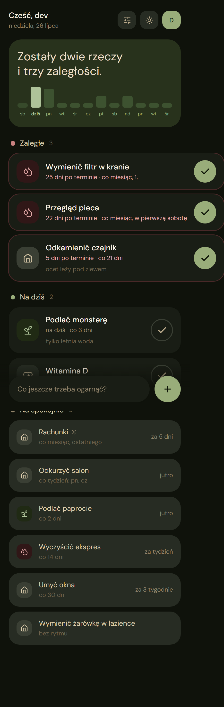
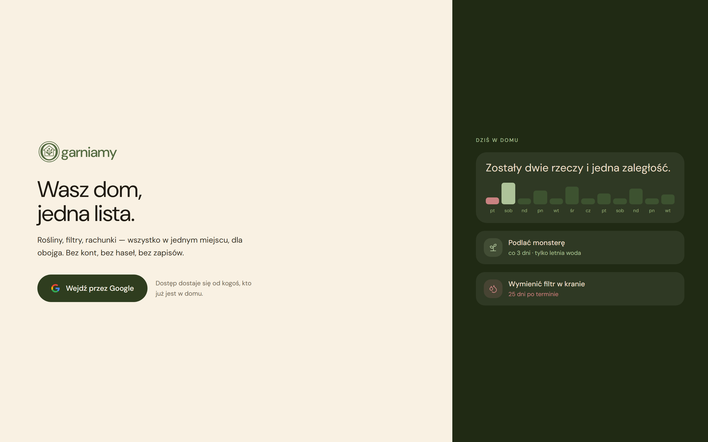
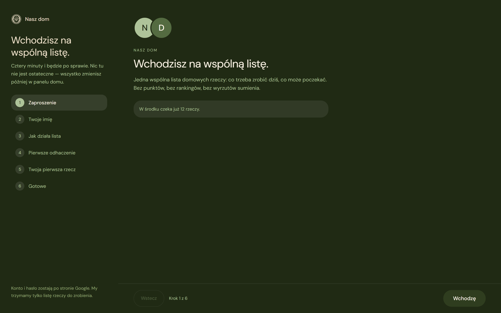
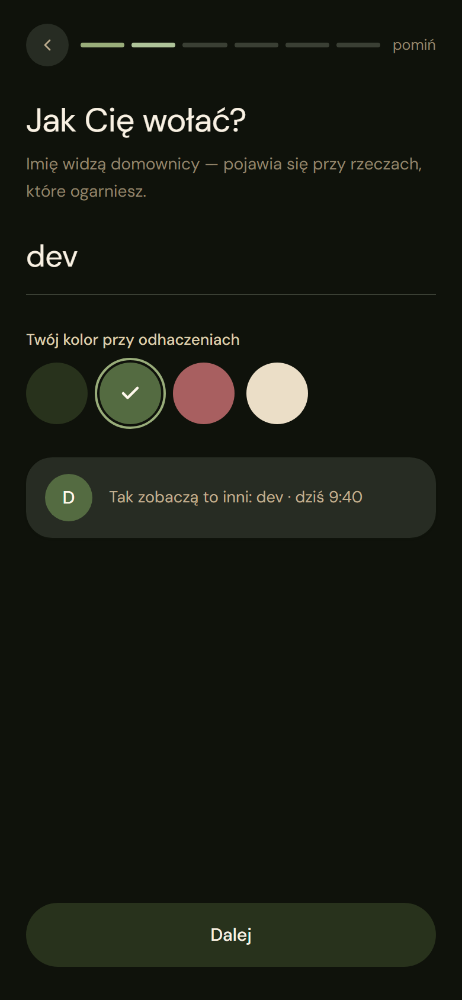
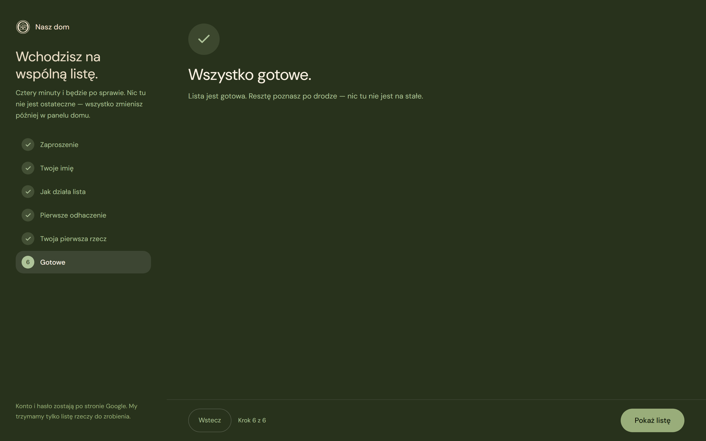
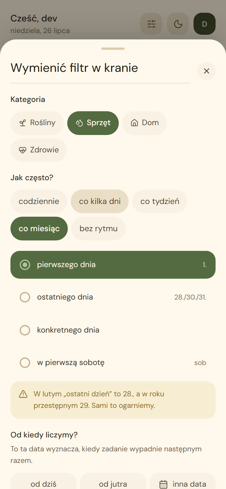
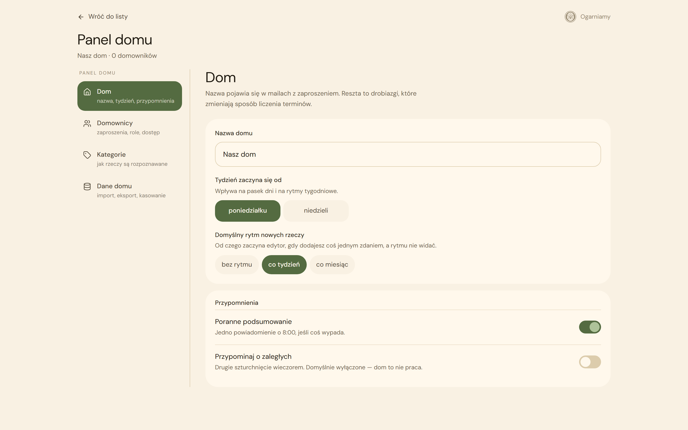
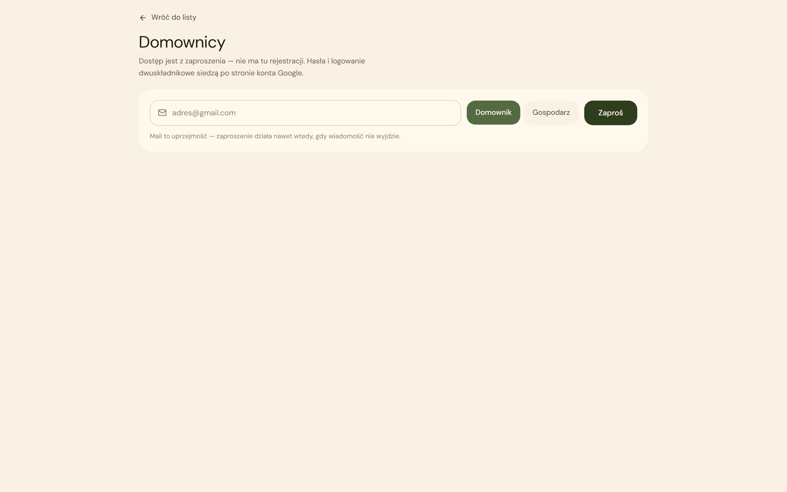

# Ogarniamy

A shared to-do list for the stuff around the house that's easy to do and even easier to forget —
watering the plants, changing a filter, restocking batteries, paying a bill that's due once a
month. Everyone in the household sees the same list, on their own phone or laptop, and it stays in
sync.

  
  &nbsp;
  

## Who it's for

Ogarniamy is invite-only — it's built for one household (or a small group sharing a space), not
the general public. Someone with admin access invites you by email, you sign in with Google, and
you're in. There's no public sign-up, no password to remember, and no separate account to create.

## A quick tour

### 1. Sign in with Google

No new password, no separate account — if you've been invited, your Google account is all you
need.

  

### 2. A short welcome the first time

The first sign-in walks you through a four-minute setup: what the list is for, your name, and a
colour so your housemates can tell whose tasks are whose. Nothing here is final — it can all be
changed later from the household settings.

  
  &nbsp;
  
  &nbsp;
  

### 3. Your day at a glance

Every task lands in one of three groups: **Zaległe** (overdue), **Na dziś** (today), or **Na
spokojnie** (not due yet). A banner up top sums up what's left, and a weekly card shows who's done
what — so chores stay visible instead of becoming an argument.

### 4. Mark things done — and undo if you tap too fast

One tap closes a task out. It reappears on its own, on schedule — the app understands the
difference between "every 3 days" and "once a month, on the 1st," so paying a bill a few days late
doesn't quietly drag its due date forward with it. Tapped the wrong one? There's a few seconds to
undo before it's final.

  

### 5. Running the household

Whoever administers the household has a settings page — **Panel domu** — for naming the home,
picking a default schedule for new tasks, choosing reminder times, editing categories, and
inviting or removing people. No email needs to actually send for an invite to work.

  
  &nbsp;
  

## What it does, in short

- Splits tasks into overdue / today / not-yet-due, so it's always obvious what actually needs
  attention
- One tap to mark something done, with a short undo window
- Recurring schedules — daily, every few days, weekly, monthly, or one-off — anchored to a real
  date so late completions don't silently reschedule the next one
- Per-person attribution and a weekly tally of who did what
- Categories, pinning, and an archive for tasks that are done for the season but not deleted for
  good
- A household settings page for names, schedules, reminders, categories, and invites
- Works equally well on a phone on the fridge or a laptop, light or dark

## Want the details?

This README is deliberately the friendly version. For the stack, local setup, running the test
suite, and how deployment works, see the **[technical README](docs/README.md)** — written for
anyone who wants to run it themselves or poke around the code.
