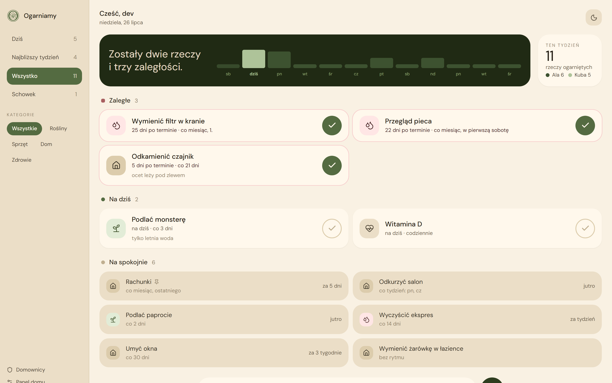

# Ogarniamy

A shared to-do list for the stuff around the house that's easy to do and even easier to forget —
watering the plants, changing a filter, restocking batteries, paying a bill that's due once a
month. Everyone in the household sees the same list, on their own phone, and it stays in sync.

  

## What it does

- **Shows what actually needs attention today** — split into *Zaległe* (overdue), *Na dziś*
  (today) and *Na spokojnie* (everything else, not urgent yet).
- **One tap to mark something done.** It reappears on its own next time it's due — the app knows
  the difference between "every 3 days" and "once a month, on the 1st," so paying a bill a few
  days late doesn't quietly shift its due date forward.
- **Remembers who did what.** Every completed task is attributed to the person who did it, with a
  weekly tally so the household can see how chores are actually being shared.
- **A quick "undo"** for the inevitable accidental tap — a few seconds to take it back before it's
  final.
- **Categories, pinning, and an archive** for tasks that are done for the season but not deleted
  for good.
- **A household settings page** ("Panel domu") for naming the home, choosing default categories,
  and inviting or removing people.
- Works equally well on a phone on the fridge or a laptop, light or dark.

## Who it's for

Ogarniamy is invite-only — it's built for one household (or a small group sharing a space), not
the general public. Someone with admin access invites you by email, you sign in with Google, and
you're in. There's no public sign-up.

## Using it

If you've been invited, sign in with your Google account at the app's address and you'll land on
the dashboard. First time in, a short walkthrough asks for your name and a colour so your
housemates can tell whose tasks are whose.

If you administer the household (invite people, manage categories, adjust settings), look for
**Panel domu** in the sidebar.

## Want the details?

This README is deliberately the friendly version. For the stack, local setup, running the test
suite, and how deployment works, see the **[technical README](docs/README.md)** — written for
anyone who wants to run it themselves or poke around the code.
