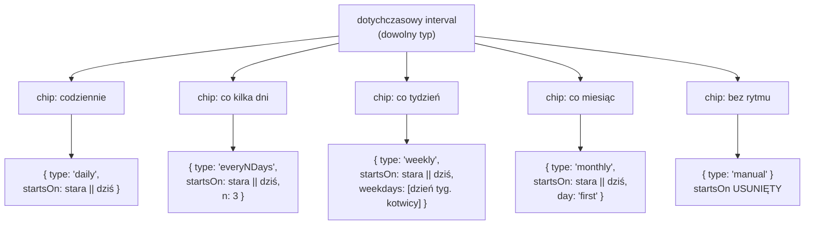
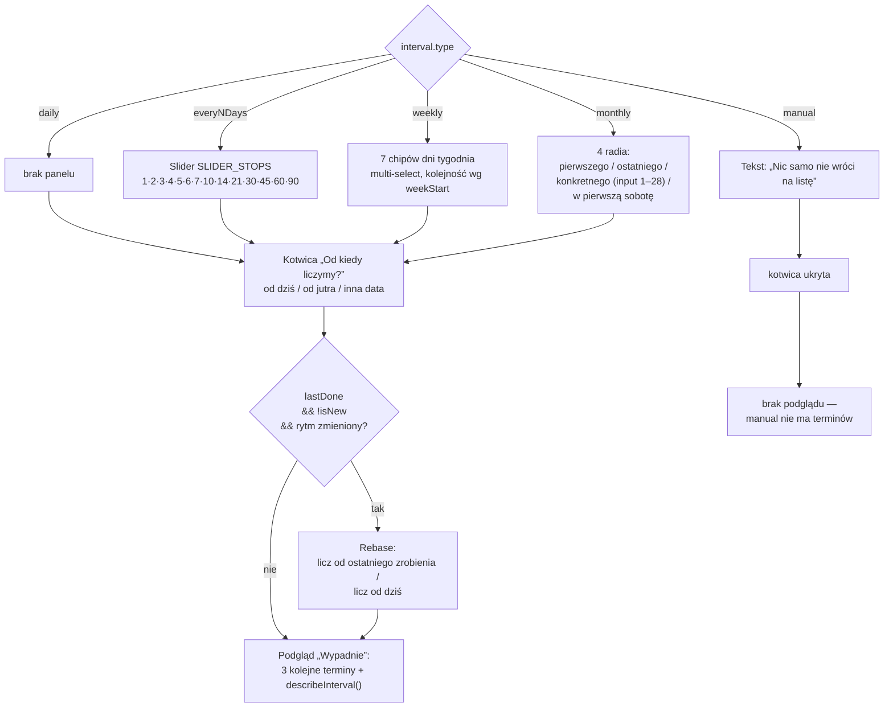
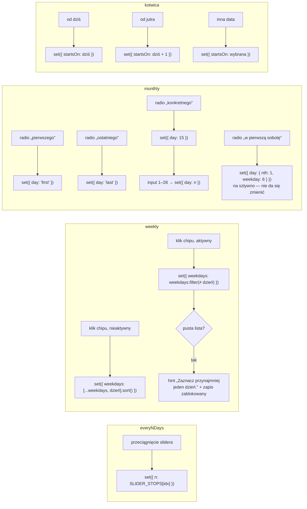
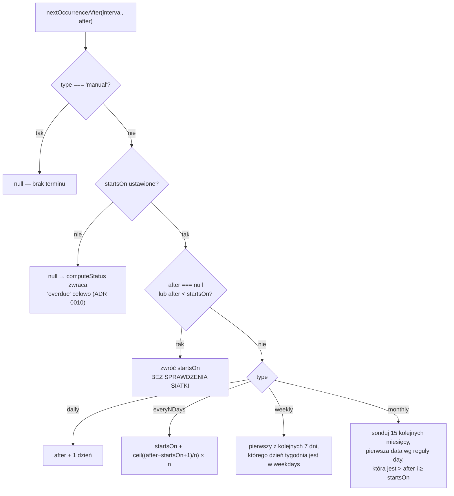
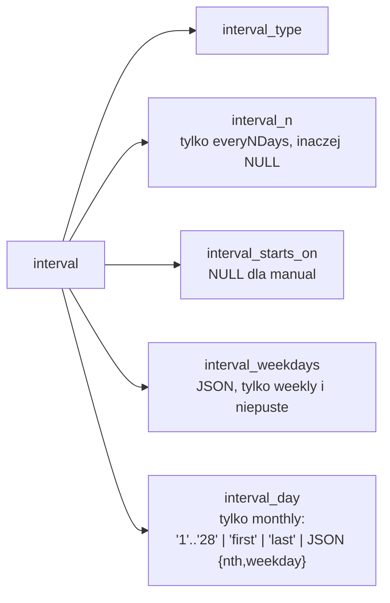
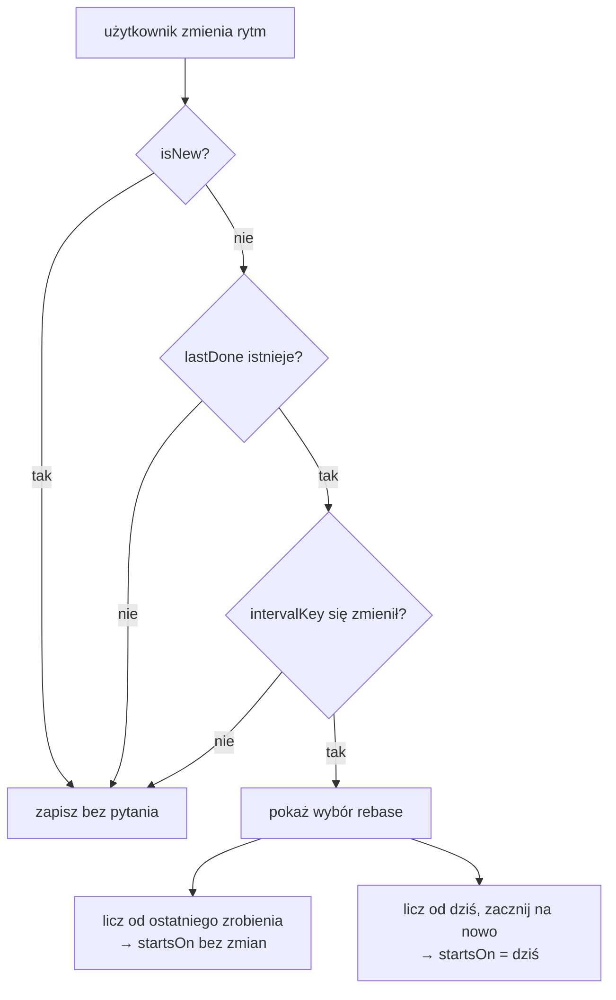

# RhythmEditor — co robi każde kliknięcie

Stan obecny (przed rozszerzeniem `monthly` o krotność). Źródła:
[`src/components/RhythmEditor.jsx`](../src/components/RhythmEditor.jsx),
[`src/lib/recurrence.js`](../src/lib/recurrence.js),
[`src/lib/constants.js`](../src/lib/constants.js).

Edytor nie trzyma własnego stanu. Dostaje jeden obiekt `interval` z
[`TaskSheet`](../src/components/TaskSheet.jsx) i po każdym kliknięciu oddaje **nowy**
obiekt przez `onChange`. Wszystko poniżej to opis tego, jak ten jeden obiekt się zmienia.

---

## 1. Chipy rytmu — przebudowa obiektu od zera

`setType()` nie robi merge'a. Buduje nowy obiekt i dokłada **tylko** pola pasujące do
typu. Dlatego przełączenie „co tydzień” → „co miesiąc” gubi `weekdays`, a powrót nie
przywraca ich — dostajesz wartość domyślną.

Jedyne pole, które przeżywa przełączanie, to `startsOn`.

> **Pułapka:** `n = interval.n || 3` czyta z obiektu, w którym `n` już nie istnieje
> (bo poprzedni typ go nie miał). Czyli wyjście z „co kilka dni” i powrót zawsze
> resetuje do 3 — nie do tego, co było ustawione wcześniej. Tak samo `weekdays`
> i `day`.
>
> **Druga pułapka:** wyjście na „bez rytmu” kasuje `startsOn`. Powrót na dowolny
> rytm ustawia kotwicę na **dziś**, nawet jeśli przed chwilą była inna data.

---

## 2. Który panel się pokazuje

Panele są rozłączne. Dni tygodnia **nie** pojawiają się przy „co miesiąc” — to już
jest zagatowane.

---

## 3. Co robi każda kontrolka wewnątrz panelu

---

## 4. Jak pola przekładają się na terminy

`nextOccurrenceAfter(interval, after)` — `after` to `lastDone`, albo `null` gdy
zadanie nigdy nie było zrobione.

> **To jest ten „wybór dni bez sensu”.** Gałąź `SNAP` zwraca kotwicę dosłownie.
> Więc „co miesiąc → pierwszego dnia”, kotwica `od dziś` = 27 lipca, daje podgląd
> `27.07 → 01.09 → 01.10`. Wybrany dzień miesiąca jest respektowany dopiero od
> drugiego terminu. Analogicznie „co tydzień: pn” z kotwicą we wtorek — pierwszy
> termin wypada we wtorek.
>
> Propozycja naprawy (opcja A z rozmowy): zamiast `return start` zwracać pierwszy
> punkt siatki **≥** `start`. Kotwica przestaje znaczyć „pierwszy termin”, zaczyna
> znaczyć „nie wcześniej niż”.

---

## 5. Zapis — co ląduje w D1

`intervalColumns()` w [`worker/db.js`](../worker/db.js) zeruje kolumny nienależące do
typu, więc w bazie nie zostaje sierota po poprzednim rytmie.

---

## 6. Rebase — dlaczego w ogóle pyta

Zmiana rytmu na zadaniu, które już było robione, przesuwa następny termin. Dlatego
`TaskSheet` porównuje `intervalKey(form.interval)` z kluczem sprzed edycji
(`intervalKey` normalizuje kolejność pól, bo API i edytor budują obiekt inaczej).

