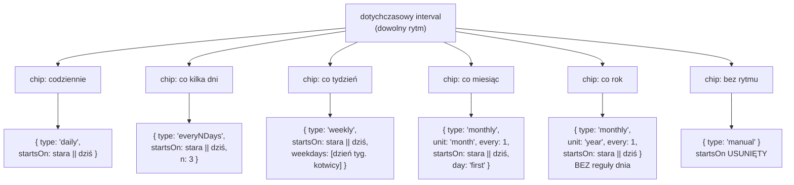
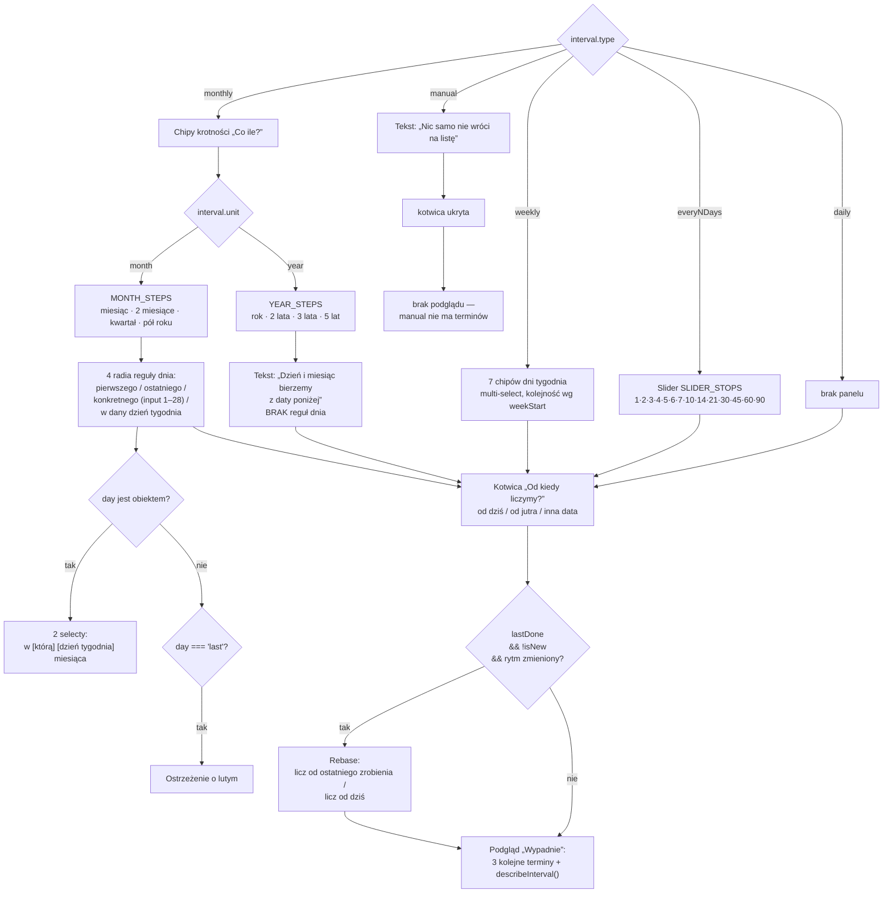
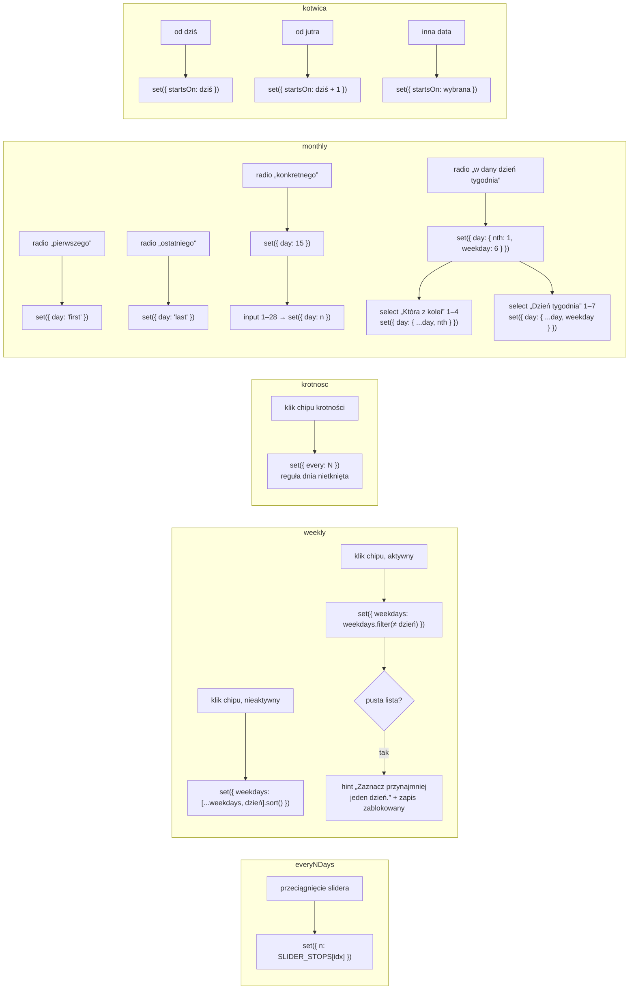
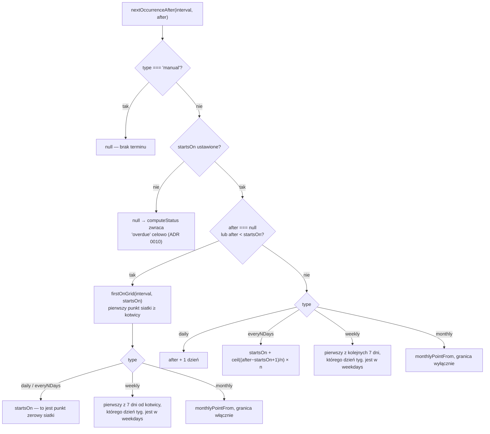
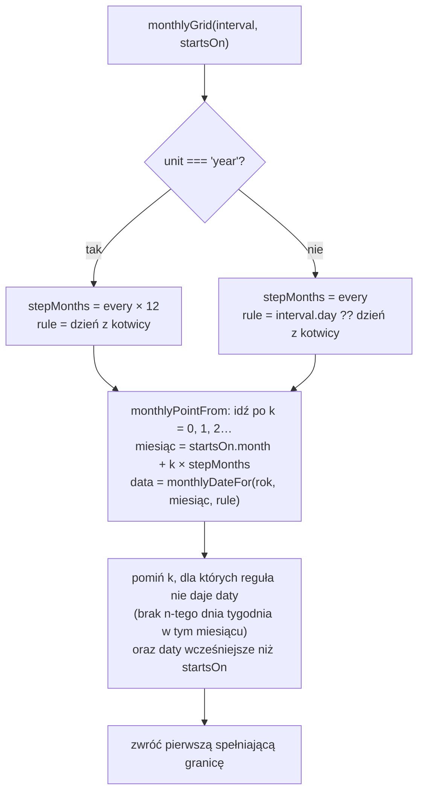
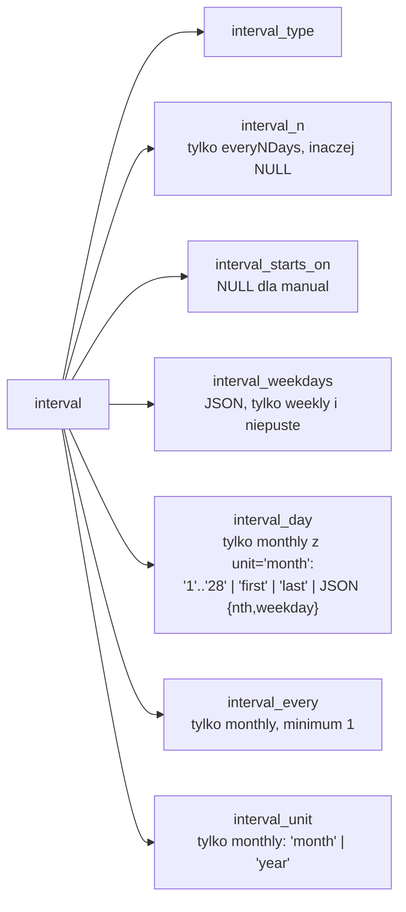
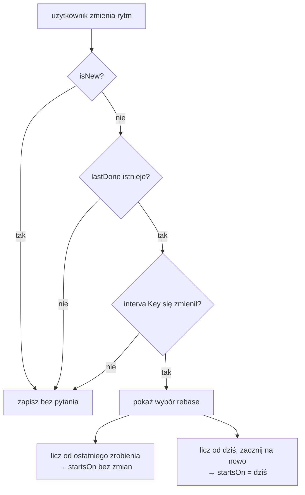

# RhythmEditor — co robi każde kliknięcie

Źródła: [`src/components/RhythmEditor.jsx`](../src/components/RhythmEditor.jsx),
[`src/lib/recurrence.js`](../src/lib/recurrence.js),
[`src/lib/constants.js`](../src/lib/constants.js). Decyzje modelowe: ADR 0010 (kotwica) i
ADR 0015 (krotność i snapowanie).

Edytor nie trzyma własnego stanu. Dostaje jeden obiekt `interval` z
[`TaskSheet`](../src/components/TaskSheet.jsx) i po każdym kliknięciu oddaje **nowy**
obiekt przez `onChange`. Wszystko poniżej to opis tego, jak ten jeden obiekt się zmienia.

---

## 1. Chipy rytmu — przebudowa obiektu od zera

`setRhythm()` nie robi merge'a. Buduje nowy obiekt i dokłada **tylko** pola pasujące do
rytmu. Dlatego przełączenie „co tydzień” → „co miesiąc” gubi `weekdays`, a powrót nie
przywraca ich — dostajesz wartość domyślną.

Jedyne pole, które przeżywa przełączanie, to `startsOn`.

> **Miesiące i lata to jeden typ.** Oba zapisują `type: 'monthly'`; rozróżnia je `unit`.
> Powód jest kosztowy, nie estetyczny: `interval_type` ma constraint `CHECK`, którego D1 nie
> potrafi `ALTER`, więc osobny typ `yearly` oznaczałby przebudowę tabeli (ADR 0015). Chipy
> są mimo to osobne, bo „co 2 lata” schowane w panelu miesięcznym byłoby nieodnajdywalne.
>
> **Krotność nie przechodzi między jednostkami.** Przejście „co 3 miesiące” → „co rok”
> resetuje `every` do 1. „Co 3 lata” po jednym kliknięciu byłoby nieprzyjemną niespodzianką.
>
> **Pułapka:** `n = interval.n || 3` czyta z obiektu, w którym `n` już nie istnieje
> (bo poprzedni typ go nie miał). Czyli wyjście z „co kilka dni” i powrót zawsze
> resetuje do 3 — nie do tego, co było ustawione wcześniej. Tak samo `weekdays` i `day`.
>
> **Druga pułapka:** wyjście na „bez rytmu” kasuje `startsOn`. Powrót na dowolny
> rytm ustawia kotwicę na **dziś**, nawet jeśli przed chwilą była inna data.

---

## 2. Który panel się pokazuje

Panele są rozłączne. To jest ta „część widoku schowana za logiką”: dni tygodnia nie
pojawiają się przy rytmach miesięcznych, reguły dnia nie pojawiają się przy rocznym, a
ostrzeżenie o lutym tylko przy „ostatniego dnia”.

> **Krotność poza listą chipów zostaje.** Jeśli `every` nie pasuje do żadnego chipa (import,
> ręczna edycja w D1), pod rzędem pojawia się opis słowny, zamiast cichego snapowania do
> najbliższej wartości.

---

## 3. Co robi każda kontrolka wewnątrz panelu

> **Porządkowe kończą się na czwartej.** Piąty dzień tygodnia w większości miesięcy nie
> istnieje, więc jego oferowanie dawałoby regułę, która po cichu pomija miesiące.

---

## 4. Jak pola przekładają się na terminy

`nextOccurrenceAfter(interval, after)` — `after` to `lastDone`, albo `null` gdy
zadanie nigdy nie było zrobione.

Miesięczna gałąź jest jedna dla obu jednostek:

> **Rok to dwanaście miesięcy, nie osobna gałąź.** Dzięki temu 29 lutego działa bez wyjątku:
> `monthlyDateFor` przycina regułę do długości miesiąca, więc kotwica z dnia przestępnego
> wypada 28. w latach zwykłych i wraca na 29. w przestępnych.
>
> **Kotwica znaczy „nie wcześniej niż”, nie „pierwszy termin”.** Wcześniej ta gałąź zwracała
> `startsOn` dosłownie, więc „co miesiąc → pierwszego dnia” z kotwicą 27 lipca dawało podgląd
> `27.07 → 01.09 → 01.10` — jeden termin poza siatką, dopiero potem reguła. Naprawione w
> ADR 0015. Zmiana dotyczy też **istniejących** zadań z kotwicą poza siatką i bez wykonania;
> zadania z `lastDone` były zawsze liczone z siatki.

---

## 5. Zapis — co ląduje w D1

`intervalColumns()` w [`worker/db.js`](../worker/db.js) zeruje kolumny nienależące do
rytmu, więc w bazie nie zostaje sierota po poprzednim.

> **Przy `unit: 'year'` kolumna `interval_day` jest zerowana.** Reguła dnia po poprzednim
> życiu jako rytm miesięczny mogłaby tylko kłócić się z kotwicą, która trzyma miesiąc i dzień.
>
> **Brak `every`/`unit` czyta się jako `every: 1, unit: 'month'`.** Tak wygląda każdy wiersz
> zapisany przed migracją 0008 i tak samo wyglądają wpisy w katalogu chore, które nie muszą
> tego powtarzać 85 razy.

---

## 6. Rebase — dlaczego w ogóle pyta

Zmiana rytmu na zadaniu, które już było robione, przesuwa następny termin. Dlatego
`TaskSheet` porównuje `intervalKey(form.interval)` z kluczem sprzed edycji.

> **`intervalKey` normalizuje `every` i `unit`, i to jest nośne.** Bez tego wiersz sprzed
> migracji 0008 nie byłby równy temu samemu rytmowi odbudowanemu przez edytor, i arkusz
> pytałby „od czego liczyć?” o rytm, którego nikt nie dotknął.

---

## 7. Podgląd — kiedy pokazuje rok

`formatDate(date, { withYear })`, ustawiane per data dla lat innych niż bieżący. Bez tego
„co 2 lata” czytało się jako `27 lipca · 27 lipca · 27 lipca` — trzy poprawne daty, 2026,
2028 i 2030, wyrenderowane identycznie.
