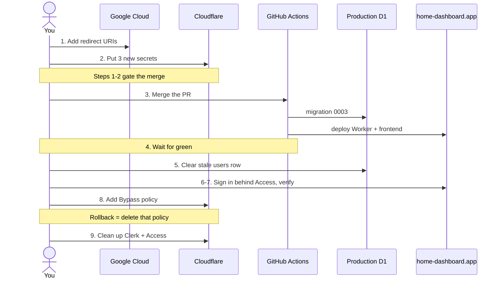

# Better Auth cutover runbook

Replacing Clerk with self-hosted Better Auth (Google-only) on `home-dashboard.app`. ADR 0009.
Written 2026-07-25, supersedes the Clerk cutover runbook.

Working directory: `c:\code\home-dashboard`

**Already done — don't redo:** the code (branch `feature/better-auth-google`), migration
`0003_better_auth_tables.sql`, tests (52 passing), production build, `wrangler deploy --dry-run`, and
a local runtime check confirming the Google redirect URI and client ID resolve correctly at module
scope. Cloudflare Access is **still gating the edge**, so nothing is publicly exposed yet.

**Verified for you, so you don't have to check:** production currently holds only
`CLERK_SECRET_KEY`, `CLERK_WEBHOOK_SIGNING_SECRET` and `INITIAL_ADMIN_EMAIL` as secrets — the three
new ones do not exist yet.

## Why these steps are yours and not mine

| Step | Reason |
|---|---|
| 1 — Google redirect URIs | Browser-only. Editing a Web OAuth client's redirect URIs has no public API, and `gcloud` isn't installed here anyway. |
| 2 — secrets | Credentials only you hold. The commands below prompt or pipe, so no value passes through the chat transcript or the repo (ADR 0005). |
| 5 — clear `users` row | Destructive on production data. |
| 6 — Access Bypass policy | Flips live production auth. Your call, and the one irreversible step. |
| 9 — delete Clerk instance | Destructive and outward-facing. The `clerk` CLI *can* do it; I'm not doing it unprompted. |

## The flow



## Steps

**1. Add the two redirect URIs to the existing Google OAuth client.** *(blocking — do before step 3)*

Reuse the client created for Cloudflare Access; there's no need for a new one.

1. Google Cloud Console → **APIs & Services** → **Credentials**
2. Open the existing **OAuth 2.0 Client ID** of type *Web application*
3. Under **Authorised redirect URIs**, add both:
   - `https://home-dashboard.app/api/auth/callback/google`
   - `http://localhost:8787/api/auth/callback/google`
4. Save, and copy the **Client ID** and **Client secret** for the next step

The localhost entry is what removes the need for a separate development instance — Google permits
plain `http` for `localhost` only. Add it now even if you only care about production; it costs
nothing and local development is broken without it.

Trap: the URI must match byte for byte, including the scheme and the absence of a trailing slash.
A mismatch surfaces at sign-in as Google's `redirect_uri_mismatch`, not as anything in our logs.

**2. Set the three new production secrets.** *(blocking — do before step 3)*

Each command prompts for the value, or pipes it, so nothing lands in your shell history or this
transcript.

```bash
# Generated, never typed or displayed — piped straight into Cloudflare.
openssl rand -base64 32 | npx wrangler secret put BETTER_AUTH_SECRET

# Paste each when prompted, from step 1.
npx wrangler secret put GOOGLE_CLIENT_ID
npx wrangler secret put GOOGLE_CLIENT_SECRET
```

Optional — the invite email. Skip both and invites still work; the D1 row is the source of truth and
the admin portal will simply tell you the email wasn't sent, so you can pass the invite on yourself.

```bash
npx wrangler secret put RESEND_API_KEY
```

If you do use Resend, its sending domain must be verified for `home-dashboard.app`, and
`INVITE_EMAIL_FROM` in `wrangler.jsonc` must match that domain.

Leave `INITIAL_ADMIN_EMAIL` alone — it's already set and still used. Don't remove the Clerk secrets
yet; they become dead at step 3 but are harmless, and keeping them means step 9 is the only cleanup.

Trap: `BETTER_AUTH_SECRET` is a *data-encryption* key as well as a signing key. Set it once and leave
it. Rotating it later needs the versioned `BETTER_AUTH_SECRETS` form, not a plain overwrite.

**3. Merge the PR.**

CI applies migration `0003` and then deploys. Access still gates the hostname, so nothing
user-visible changes yet — the new login screen is live but unreachable from outside.

Do not merge before steps 1 and 2. The migration is safe either way, but the deployed Worker would
have no Google credentials and no `BETTER_AUTH_SECRET`, and Better Auth refuses to start in
production without the latter.

**4. Wait for the Actions run to go green.**

```bash
gh run watch
```

Don't skip this. If the deploy failed and you add the Bypass policy at step 6 anyway, the site ends
up both broken *and* unprotected.

Also worth a glance while you're here — this is the one thing I could not verify locally:

```bash
npx wrangler tail --format pretty
```

Load the site and watch for `exceededCpu` or `exceededResources`. This account is on **Workers Free**,
which caps CPU at 10 ms per request. There's no password hashing in this design, which is what makes
that budget realistic, and Better Auth is built at module scope so its setup cost falls under the
1-second startup budget instead. If you do see CPU errors, the fix is a config change rather than a
redesign: upgrade to Workers Paid, still far below Clerk Pro's $20–25/mo.

**5. Clear the stale user row.** *(destructive)*

```bash
npx wrangler d1 execute home-dashboard-db --remote --command "DELETE FROM users;"
```

`authorize()` looks up your row by email, and the bootstrap-to-admin path only fires when the table
is **empty**. Clearing it lets your first Google sign-in self-provision you as admin. If a stale row
survives, you land as a plain `member` with no admin link and no way to invite anyone.

Safe for history: `tasks.created_by_email`, `tasks.last_done_by_email` and
`completions.completed_by_email` are plain TEXT with no foreign key to `users`, so task attribution
is untouched.

Check `INITIAL_ADMIN_EMAIL` matches the Google account you'll actually sign in with:

```bash
npx wrangler secret list   # confirms it exists; the value is write-only
```

**6. Sign in — while Access is still up.**

Go to <https://home-dashboard.app>. Access will challenge you first (Google SSO, as today), then the
app's own Better Auth login screen appears behind it. Click **Zaloguj się przez Google**.

You should land on the dashboard with a **Panel administracyjny** link in the header. That link
appearing is what proves three things at once: the bootstrap fired, you hold the `admin` role, and
the role mirrored correctly into Better Auth's own table.

This step is the whole reason this cutover is safer than the last one. Better Auth runs *in* the app
rather than at the edge, so you get to verify it in production while Access is still protecting the
hostname. Nothing irreversible has happened yet.

**7. Invite your partner and check the transition.**

From `/admin`, invite their address. Their row shows as *zaproszony, jeszcze się nie logował*. Have
them sign in with Google — behind Access, so they'll need to pass that too for now — and the row
should flip to active. That transition is now a database hook rather than a webhook, so there's no
signing secret and no public endpoint involved.

Then have them complete a task and confirm their name shows against it on your device after a
refresh.

**8. Stop Access from gating the app** by adding a Bypass policy. *(irreversible-ish — the one step
with a real blast radius)*

There is no "disable" switch on an Access application or policy — the dashboard only offers create,
edit and delete. The supported way to turn enforcement off while keeping the configuration is a
policy with the **Bypass** action, which per Cloudflare's docs "disables any Access enforcement for
traffic that meets the defined rule criteria."

1. Cloudflare dashboard → **Zero Trust** → **Access controls** → **Applications**
2. Open the `home-dashboard` application
3. Add a policy with:

   | Action | Rule type | Selector | Value    |
   | ------ | --------- | -------- | -------- |
   | Bypass | Include   | Everyone | Everyone |

4. Order it **above** the existing `Allow / Login Methods = Google` policy, and save

Leave the original Allow policy in place. Rollback is then just deleting the Bypass policy — the
Google SSO gate resumes immediately, with nothing to retype.

Two things to know:

- Bypass policies can't use identity-based selectors (no email, no login method), which is why this
  is a separate Everyone policy rather than editing the existing one's action.
- While bypassed, Access performs no checks and **does not log requests**. That's the intent here —
  Better Auth becomes the gate — but Access logs go quiet from this point.

Now re-run step 6's sign-in from a fresh private window to confirm the app is reachable and gated by
Better Auth alone. Also confirm an *uninvited* Google account is refused with "To konto nie ma
dostępu" — that's the invite gate doing its job with Access no longer masking it.

**9. Clean up, after a few days of the Bypass policy behaving.** *(all optional, all reversible
except the Clerk deletion)*

```bash
# Dead since step 3.
npx wrangler secret delete CLERK_SECRET_KEY
npx wrangler secret delete CLERK_WEBHOOK_SIGNING_SECRET
```

Then, in whatever order suits you:

- Delete the Cloudflare Access application (removes the Bypass policy with it)
- Delete the Clerk production instance. The CLI can do this, or the dashboard can — either way it's
  your call to make, not something I'll run unprompted.
- Ask me to drop the now-dead `users.clerk_user_id` column in a follow-up migration. It's
  deliberately left in place by `0003` because dropping a column the previously-live Worker read
  would not have been backward-compatible (ADR 0007).
- Delete this runbook.

## If something fails

**Step 6 — Google says `redirect_uri_mismatch`.** Step 1's URI doesn't match exactly. Compare against
the one the app actually sends:

```bash
curl -s -X POST https://home-dashboard.app/api/auth/sign-in/social \
  -H 'Content-Type: application/json' -d '{"provider":"google","callbackURL":"/"}'
```

The `redirect_uri` in the returned URL is the literal string Google needs to have on file.

**Step 6 — no admin link.** The bootstrap didn't fire. Send me:

```bash
npx wrangler d1 execute home-dashboard-db --remote --command "SELECT email, role, status FROM users;"
```

Most likely step 5 didn't run, or `INITIAL_ADMIN_EMAIL` differs from the Google address you used.

**Step 6 — 403 "Not authorized".** The email Google reports doesn't match any row. Same query as
above.

**Step 6 — "Brak zaproszenia" for your own admin account.** The invite gate refused to create your
identity, which means `users` wasn't empty *and* had no row for you. Run step 5 again.

**Step 6 — 500 on every request.** Usually a missing secret. `npx wrangler secret list` should show
`BETTER_AUTH_SECRET`, `GOOGLE_CLIENT_ID`, `GOOGLE_CLIENT_SECRET` and `INITIAL_ADMIN_EMAIL`. Then check
`npx wrangler tail` for the actual error.

**Step 7 — partner stuck as pending.** They signed in but the `create.after` hook didn't flip the
row, or they signed in with a different address than you invited. Compare:

```bash
npx wrangler d1 execute home-dashboard-db --remote --command "SELECT email, status FROM users;"
npx wrangler d1 execute home-dashboard-db --remote --command "SELECT email FROM user;"
```

Note those are two different tables — `users` is ours, `user` is Better Auth's.

**Anything else, at any point after step 8.** Delete the Bypass policy to restore the Google SSO gate
while we debug. The app keeps working for you, just behind Access again.
