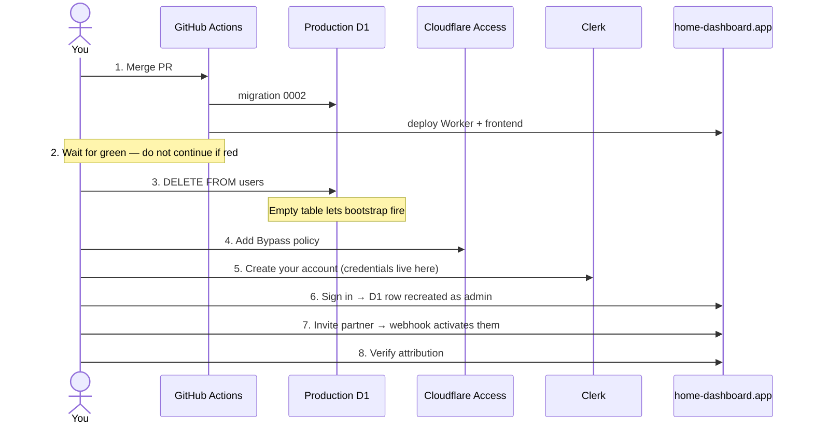

# Clerk cutover runbook

Replacing Cloudflare Access with Clerk on `home-dashboard.app`. Written 2026-07-25.

Working directory: `c:\code\home-dashboard`

**Already done — don't redo:**
`CLERK_SECRET_KEY`, `CLERK_WEBHOOK_SIGNING_SECRET`, publishable key (Worker vars + CI build),
`INITIAL_ADMIN_EMAIL` → `contact@gustawbeznicki.dev`, webhook endpoint, production domain verified.

**Steps 1–3 and 5 complete** (verified 2026-07-25): PR #8 merged, deploy run succeeded, migration
`0002` applied to remote D1 (`wrangler d1 migrations list --remote` reports nothing pending), `users`
table cleared, and the production Clerk account `contact@gustawbeznicki.dev`
(`user_3H0OICnm9LldXY9HVFIiNwZMWUb`) created via `clerk users create` against instance
`ins_3H04EoRI1vavgwpJKTBgBC1QnVi`.

Its password is a discarded random value — set your own with **Forgot password?** on the login screen
once step 4 makes it reachable.

**Next up: step 4, then 6.**

## The flow



## Steps

**1. Merge PR #8** — <https://github.com/gustaw-beznicki/Home-dashboard/pull/8>

CI applies migration `0002` first, then deploys. Access still gates the site, so nothing visibly
changes yet.

**2. Wait for the Actions run to go green.**

```bash
gh run watch
```

Do not skip this. If the deploy failed and you disable Access at step 4 anyway, the site ends up
both broken *and* unprotected.

**3. Clear the stale user row.**

```bash
npx wrangler d1 execute home-dashboard-db --remote --command "DELETE FROM users;"
```

The table currently holds one row for `g.beznicki@gmail.com`, but you'll sign in as
`contact@gustawbeznicki.dev`. `authorize()` looks up the row by email — a mismatch is a 403, and the
bootstrap-to-admin path only fires when the table is **empty**. Clearing it lets your first sign-in
self-provision you as admin with `clerk_user_id` filled in correctly.

Safe for history: `tasks.created_by_email`, `tasks.last_done_by_email` and
`completions.completed_by_email` are plain TEXT with no foreign key to `users`, so task attribution
is untouched.

**4. Stop Access from gating the app** by adding a Bypass policy.

There is no "disable" switch on an Access application or policy — the dashboard only offers create,
edit, and delete. The supported way to turn enforcement off while keeping the configuration is a
policy with the **Bypass** action, which per Cloudflare's docs "disables any Access enforcement for
traffic that meets the defined rule criteria."

1. Cloudflare dashboard → **Zero Trust** → **Access controls** → **Applications**
2. Open the `home-dashboard` application
3. Add a policy with:

   | Action | Rule type | Selector | Value    |
   | ------ | --------- | -------- | -------- |
   | Bypass | Include   | Everyone | Everyone |

4. Order it **above** the existing `Allow / Login Methods = Google` policy, and save

Leave the original Allow policy in place. Rollback is then just deleting the Bypass policy — the
Google SSO gate resumes immediately, with nothing to retype.

Two things to know:

- Bypass policies can't use identity-based selectors (no email, no login method), which is why this
  is a separate Everyone policy rather than editing the existing one's action.
- While bypassed, Access performs no checks and **does not log requests**. That's the intent here —
  Clerk becomes the gate — but it does mean Access logs go quiet from this point.

Note the navigation moved: it's **Access controls → Applications**, not the older
**Access → Applications**.

**5. Create your Clerk account** — ✅ **done**, via
`clerk users create --instance ins_3H04EoRI1vavgwpJKTBgBC1QnVi`. Kept here for the record, since the
reasoning matters for the next person.

Note the CLI can do this: `clerk users create` wraps `POST /users`, so it doesn't need the dashboard.
It does require a password when the instance has password auth enabled — supply it via `--file` with
a JSON body rather than `--data` inline, so the value never lands in a shell history or transcript.

This step is easy to miss but mandatory. The two systems hold different things:

- **Clerk** owns the account and credentials — the thing you log in *with*.
- **D1 `users`** owns authorization — whether that identity is allowed in, and at what role.

Step 3 emptied the D1 table, not Clerk. Your Clerk account is unaffected by it, and clearing D1 is
exactly what lets `authorize()` insert you back as `admin` on first sign-in.

You can't self-serve this through the app: `LoginScreen` mounts only Clerk's `<SignIn />`, with no
`<SignUp />` and no sign-up route — deliberate for an invite-only household app. Your partner won't
need this step, because Clerk's invitation email carries them through account creation; but nobody
can invite the first admin, so it's done by hand here.

Can be done any time in advance — it doesn't depend on steps 1–4.

**6. Set your password, then sign in** at <https://home-dashboard.app>.

The account exists but its password is a random value nobody holds. On the login screen, use
**Forgot password?** with `contact@gustawbeznicki.dev`, follow the email, and set your own. Then sign
in.

You should land on the dashboard with a **Panel administracyjny** link in the header. That link
appearing is what proves the bootstrap fired and you hold the `admin` role.

If the reset email doesn't arrive, say so — I can mint a one-time sign-in link with
`clerk api -X POST /sign_in_tokens` instead, which is the same mechanism the admin portal's
"reset password" button uses.

**7. Invite your partner** from `/admin`.

Their row appears as `zaproszenie wysłane` (pending) and flips to active once they accept. That
transition is the proof the Clerk webhook is reaching the Worker and its signature verifies.

**8. Verify attribution.**

Have them complete a task; confirm their name shows against it on your device after a refresh.

## If something fails

**Step 6 — no admin link.** Bootstrap didn't fire. Send me:

```bash
npx wrangler d1 execute home-dashboard-db --remote --command "SELECT email, role, status FROM users;"
```

**Step 6 — 403 "Not authorized".** The email Clerk reports doesn't match any row. Same query as
above; likely step 3 didn't run, or the Clerk account from step 5 uses a different address than
`INITIAL_ADMIN_EMAIL`.

**Step 6 — 500 on every request.** Usually a missing Clerk key on the Worker. Check:

```bash
npx wrangler secret list
```

`CLERK_SECRET_KEY` and `CLERK_WEBHOOK_SIGNING_SECRET` should be listed; `CLERK_PUBLISHABLE_KEY`
lives in `wrangler.jsonc` vars instead, not as a secret.

**Step 7 — partner stuck on pending.** The webhook isn't landing. Check delivery attempts and
responses in Clerk Dashboard → Webhooks → your endpoint. A 400 there means the signing secret
doesn't match what's in `wrangler secret`.

**Anything else.** Delete the Bypass policy from step 4 to restore the Google SSO gate while we
debug — the app keeps working for you, just behind Access again.

## Afterwards

- Keep the Bypass policy in place for a few days rather than deleting the application, so rollback
  stays one click. Once clean: delete the
  application, remove `CF_ACCESS_TEAM_DOMAIN` / `CF_ACCESS_AUD` from `wrangler.jsonc`, drop `jose`
  from `package.json`.
- Google sign-in is a separate follow-up. Production Clerk instances need your own OAuth credentials
  (they can't use Clerk's shared dev ones) — we can add Clerk's redirect URI to the Google client
  you already created for Access.
- Delete this runbook once the cutover is done.
