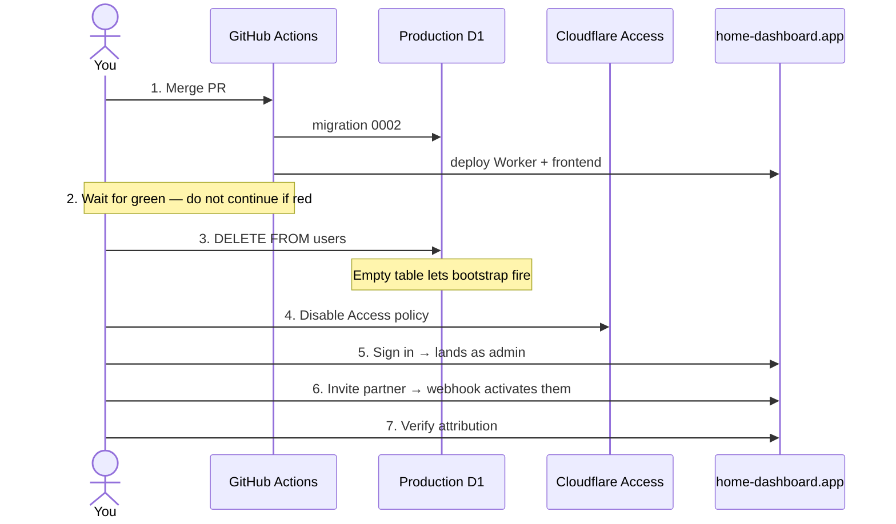

# Clerk cutover runbook

Replacing Cloudflare Access with Clerk on `home-dashboard.app`. Written 2026-07-25.

Working directory: `c:\code\home-dashboard`

**Already done — don't redo:**
`CLERK_SECRET_KEY`, `CLERK_WEBHOOK_SIGNING_SECRET`, publishable key (Worker vars + CI build),
`INITIAL_ADMIN_EMAIL` → `contact@gustawbeznicki.dev`, webhook endpoint, production domain verified,
PR #8 conflicts resolved and mergeable.

## The flow



## Steps

**1. Merge PR #8** — <https://github.com/gustaw-beznicki/Home-dashboard/pull/8>

CI applies migration `0002` first, then deploys. Access still gates the site, so nothing visibly
changes yet.

**2. Wait for the Actions run to go green.**

```bash
gh run watch
```

Do not skip this. If the deploy failed and you disable Access at step 4 anyway, the site ends up
both broken *and* unprotected.

**3. Clear the stale user row.**

```bash
npx wrangler d1 execute home-dashboard-db --remote --command "DELETE FROM users;"
```

The table currently holds one row for `g.beznicki@gmail.com`, but you'll sign in as
`contact@gustawbeznicki.dev`. `authorize()` looks up the row by email — a mismatch is a 403, and the
bootstrap-to-admin path only fires when the table is **empty**. Clearing it lets your first sign-in
self-provision you as admin with `clerk_user_id` filled in correctly.

Safe for history: `tasks.created_by_email`, `tasks.last_done_by_email` and
`completions.completed_by_email` are plain TEXT with no foreign key to `users`, so task attribution
is untouched.

**4. Disable Cloudflare Access.**

Zero Trust → Access → Applications → `home-dashboard` → **disable, don't delete**. Keeping it
configured means rollback is a minutes-away toggle.

**5. Sign in** at <https://home-dashboard.app> as `contact@gustawbeznicki.dev`.

You should land on the dashboard with a **Panel administracyjny** link in the header. That link
appearing is what proves the bootstrap fired and you hold the `admin` role.

**6. Invite your partner** from `/admin`.

Their row appears as `zaproszenie wysłane` (pending) and flips to active once they accept. That
transition is the proof the Clerk webhook is reaching the Worker and its signature verifies.

**7. Verify attribution.**

Have them complete a task; confirm their name shows against it on your device after a refresh.

## If something fails

**Step 5 — no admin link.** Bootstrap didn't fire. Send me:

```bash
npx wrangler d1 execute home-dashboard-db --remote --command "SELECT email, role, status FROM users;"
```

**Step 5 — 403 "Not authorized".** The email Clerk reports doesn't match any row. Same query as
above; likely step 3 didn't run or you signed in with a different address.

**Step 5 — 500 on every request.** Usually a missing Clerk key on the Worker. Check both are present:

```bash
npx wrangler secret list
```

`CLERK_SECRET_KEY` should be listed; `CLERK_PUBLISHABLE_KEY` lives in `wrangler.jsonc` vars instead.

**Step 6 — partner stuck on pending.** The webhook isn't landing. Check delivery attempts and
responses in Clerk Dashboard → Webhooks → your endpoint. A 400 there means the signing secret
doesn't match what's in `wrangler secret`.

**Anything else.** Re-enable the Access policy from step 4 to restore the old gate while we debug —
the app keeps working for you, just behind Google SSO again.

## Afterwards

- Keep Access disabled-but-configured for a few days as a fallback. Once clean: delete the
  application, remove `CF_ACCESS_TEAM_DOMAIN` / `CF_ACCESS_AUD` from `wrangler.jsonc`, drop `jose`
  from `package.json`.
- Google sign-in is a separate follow-up. Production Clerk instances need your own OAuth credentials
  (they can't use Clerk's shared dev ones) — we can add Clerk's redirect URI to the Google client
  you already created for Access.
- Delete this runbook once the cutover is done.
