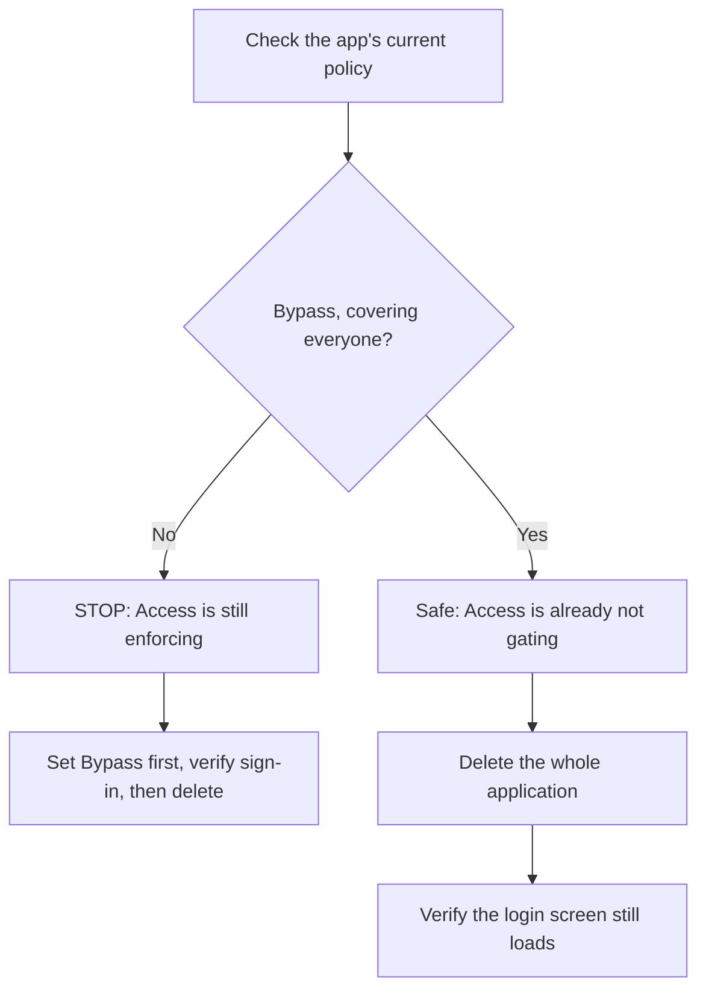

# Deleting the retired Cloudflare Access application

Working directory: `c:\code\home-dashboard`

**Already done — don't redo:** authentication moved to Better Auth in the app (ADR 0009), the
`users.clerk_user_id` column is dropped (migration 0007), and `CLAUDE.md` no longer lists anything
about Access as pending except this. Nothing in this repository reads an Access header — `grep` for
`Cf-Access`, `CF_Authorization` and `cf-access` across `src/`, `worker/` and `scripts/` returns
nothing. The application has been sitting configured-but-bypassed as an emergency fallback since the
cutover.

**Why this is yours and not mine:** *permission-gated, credential the user holds.* Cloudflare does
expose an API for Access applications, so this is not browser-only — but it needs a token with
**Access: Apps and Policies → Edit**, and the only Cloudflare credential available here is
`wrangler`'s OAuth token, whose scopes are `account (read)` and `email_routing (write)`. `wrangler`
itself has no Access or Zero Trust subcommands at all. There is no `CLOUDFLARE_API_TOKEN` in the
environment, and the one in GitHub Actions secrets is scoped for Worker deploys.

So: either route below works, and the API route means you never touch the dashboard.

---

## The shape of it

The one thing that can go wrong is deleting the application while the Bypass policy is what is
actually keeping the door open. If Access were still enforcing and you removed only the policy, the
edge would start challenging every request before the app's own login screen could load — a lockout
that no code change can fix, because Access runs *before* the Worker.



Deleting the **application** removes its policies with it. That is the intended end state — not
deleting policies one by one and leaving an empty application behind.

---

## Steps

Steps 1 and 2 are read-only and safe to run any time. Step 4 is the irreversible one.

**1. Create a scoped API token** — Cloudflare dashboard → *My Profile* → *API Tokens* → *Create
Token* → *Create Custom Token*.

Permissions: **Account** → *Access: Apps and Policies* → **Edit**. Account resources: your own
account. Nothing else — this token needs no zone or Worker access.

Copy it into your shell for this session only, so it never lands in a file or in our chat:

```sh
read -rs CF_TOKEN && export CF_TOKEN
```

Paste the token at the prompt and press Enter. `read -rs` does not echo it.

**2. Find the application and read its policy.** Blocking — do not go further until you have looked
at the output.

```sh
ACCOUNT=f21f6aaeb1de3809b94eecf501452657

curl -s -H "Authorization: Bearer $CF_TOKEN" \
  "https://api.cloudflare.com/client/v4/accounts/$ACCOUNT/access/apps" \
  | python -m json.tool | grep -E '"id"|"name"|"domain"'
```

Look for the application whose domain is `home-dashboard.app`. Note its `id`, then:

```sh
APP=<the id from above>

curl -s -H "Authorization: Bearer $CF_TOKEN" \
  "https://api.cloudflare.com/client/v4/accounts/$ACCOUNT/access/apps/$APP/policies" \
  | python -m json.tool | grep -E '"name"|"decision"|"include"'
```

**The trap is here, not later.** You are looking for `"decision": "bypass"` on a policy that includes
everyone. If instead you see `"decision": "allow"` with an email or group rule, Access is *still
enforcing* and the bypass was never applied — stop and tell me, because the order changes: the bypass
has to go on and be verified before anything is deleted.

**3. Confirm the app is reachable without an Access challenge.** Also blocking.

```sh
curl -sI https://home-dashboard.app/ | head -1
curl -s -o /dev/null -w '%{http_code}\n' https://home-dashboard.app/api/whoami
```

Expected: `200` for the page and `401` for `/api/whoami` with no session. A `302` to
`*.cloudflareaccess.com` means Access is still intercepting — same stop condition as step 2.

**4. Delete the application.** Irreversible; it takes the policies with it.

```sh
curl -s -X DELETE -H "Authorization: Bearer $CF_TOKEN" \
  "https://api.cloudflare.com/client/v4/accounts/$ACCOUNT/access/apps/$APP" \
  | python -m json.tool | head -5
```

Expect `"success": true`.

**5. Verify the app still works, in a fresh private window.** Not just a `curl` — the point is that
the real sign-in path is intact.

Open `https://home-dashboard.app`, confirm the *Ogarniamy* login screen appears (not a Cloudflare
Access screen), sign in with Google, and confirm you reach the list.

**6. Revoke the token.** It has no further use. Dashboard → *My Profile* → *API Tokens* → the token →
*Delete*. Then `unset CF_TOKEN`.

**7. Tell me it is done.** I will remove the "Cloudflare Access retirement" section from `CLAUDE.md`,
since it exists only to explain a transition that will then be finished, and open a PR for it.

---

## The dashboard route instead, if you prefer

*Zero Trust* → *Access* → *Applications* → the `home-dashboard.app` application → check under
*Policies* that the single policy is **Bypass / Everyone** → *Configuration* tab → *Delete
application* at the bottom → confirm by typing the application name.

Same stop condition applies: if the policy is anything other than a bypass covering everyone, stop
rather than deleting.

---

## If something fails

**Step 2 lists no application for `home-dashboard.app`.** It may already be deleted, or the token is
scoped to a different account. Confirm the account id matches the one in `wrangler whoami`
(`f21f6aaeb1de3809b94eecf501452657`). If the list is genuinely empty, there is nothing to do — tell
me and I will close out the `CLAUDE.md` section.

**Step 2 or 3 shows Access still enforcing.** Do not delete anything. Send me the `decision` value
and the `include` block; the bypass has to be applied and verified first, and I will write that
sequence rather than guess at it here.

**Step 4 returns `403`.** The token lacks *Access: Apps and Policies → Edit*, or it was created
against the wrong account. Recreate it with exactly that permission.

**Step 5 shows a Cloudflare Access screen instead of the login page.** Deletion may still be
propagating; wait a minute and retry in a new private window. If it persists, there is a second
Access application or a device-posture rule matching the hostname — send me the output of the step 2
listing again and stop there. The app is unreachable for the household in that state, so this is the
one failure worth interrupting me over immediately.
