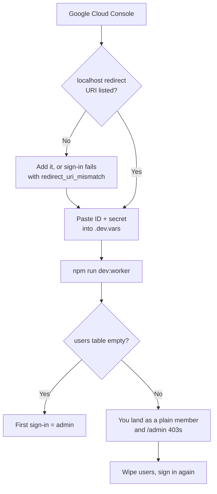

# Running the redesigned dashboard locally

Working directory: `c:\code\home-dashboard`

## Fastest route — no credentials needed

```bash
npm run dev:no-auth
```

Then open <http://localhost:8787>. That's it. Sign-in is skipped and you land on the dashboard as a
local admin with the seeded tasks. This is a **loopback-only** bypass (ADR 0011): the flag alone can't
enable it, the request also has to arrive on `localhost`, so it cannot activate on the deployed
hostname. Verified — a request with `Host: home-dashboard.app` gets a 401 even with the flag set.

Frontend edits need a re-run (or `npm run build` in another terminal and a refresh) — wrangler serves
built assets from `dist/`, so there's no HMR.

To see what a non-admin sees:

```bash
npx wrangler dev --var DEV_NO_AUTH:true --var DEV_USER_ROLE:member --var DEV_USER_NAME:Ala
```

**What this route cannot test**, because there is no real identity involved: the login screen, the
invite gate, the `INITIAL_ADMIN_EMAIL` bootstrap, and role mirroring into Better Auth's tables. It also
leaves `users` empty, so `/admin` renders but lists nobody. Anything touching those needs the real
sign-in route below.

---

## Full route — real Google sign-in

Needed when you're changing auth itself, or before shipping anything that touches it.

**Already done — don't redo:**

- `.dev.vars` has been rewritten with `BASE_URL`, a freshly generated `BETTER_AUTH_SECRET`, and
  `INITIAL_ADMIN_EMAIL`. It previously contained only dead Clerk keys; those were removed (a backup
  sits in the session scratchpad if you want them back, but Clerk is retired).
- Local D1 is fully migrated, including the new `0004_add_interval_anchor_and_variants.sql`.
- Local D1 is seeded with twelve sample tasks covering all five rhythms, all three dashboard stops,
  a pinned task, an archived one, and eleven completions so the "Ten tydzień" card has something to
  show. Re-run any time with `npm run db:seed:local`.
- `users` is deliberately **empty**, so your first sign-in bootstraps you as admin.

**You need to supply two values: the Google OAuth client ID and secret.** They only exist in your
Google Cloud Console — `wrangler secret list` returns names, never values, and `gcloud` isn't
installed here (and wouldn't manage a consumer OAuth client anyway). Everything else is done.

**One thing to clean up when you're in there:** a stale `.env.local` is sitting in the repo root with
`VITE_CLERK_PUBLISHABLE_KEY` and `CLERK_SECRET_KEY` in it. It's gitignored, and `npm run dev:worker`
ignores it — but wrangler *does* read `.env` files when `--env-file` is used, which is a confusing trap
waiting to happen. Clerk is retired, so `rm .env.local` when convenient.

---



## Steps

**1. Open your Google OAuth client.**
Go to <https://console.cloud.google.com/apis/credentials>, pick the project this app uses, and open
the OAuth 2.0 Client ID under **OAuth 2.0 Client IDs**.

If there isn't one yet, create it: **Create Credentials → OAuth client ID → Web application**. You
will also need an OAuth consent screen configured as **External**, with your own address added
under **Test users** — an unpublished app refuses sign-ins from anyone not on that list.

**2. Add the localhost redirect URI.**
Under **Authorized redirect URIs**, add exactly:

```
http://localhost:8787/api/auth/callback/google
```

Keep the production one alongside it — the same client serves both, which is deliberate (there's no
separate development instance to maintain, unlike the Clerk setup this replaced). Save.

Two traps here, both of which produce a `redirect_uri_mismatch` at the end of step 4 rather than
now: the path must be `/api/auth/callback/google` (not `/callback` or `/api/callback`), and it must
be `localhost`, not `127.0.0.1` — Google treats them as different origins, and `BASE_URL` in
`.dev.vars` is set to `localhost`.

Google can take a few minutes to propagate a redirect URI change.

**3. Paste the two values into `.dev.vars`.**
Fill the two empty lines:

```
GOOGLE_CLIENT_ID=<the Client ID>
GOOGLE_CLIENT_SECRET=<the Client secret>
```

The file is gitignored (`.gitignore:5`), so these stay out of the repo.

**4. Start the full-stack dev server.**

```bash
npm run dev:worker
```

Then open <http://localhost:8787>.

Use this, not `npm run dev`. Plain Vite has no `/api` proxy configured, so every API call 404s and
you'd see a permanently broken login screen.

**5. Sign in.**
Click **Wejdź przez Google**. Because `users` is empty and `INITIAL_ADMIN_EMAIL` is your address,
this bootstraps you as an admin — you should land on the dashboard with the seeded tasks and see the
admin affordance (the avatar chip on mobile, the "Domownicy" link in the desktop rail).

If you end up a plain member instead, the `users` table wasn't empty. Reset and sign in again:

```bash
npx wrangler d1 execute home-dashboard-db --local --command "DELETE FROM users; DELETE FROM session; DELETE FROM account; DELETE FROM user;"
```

## What to actually look at

The redesign changed the data model, not just the paint, so the interesting checks are behavioural.

**The rhythm anchor** — this is the point of the whole change.

1. Open **Wymienić filtr w kranie** (in Zaległe). It's monthly on the 1st and was last paid at the
   start of last month.
2. Tick **Zrobione**. It records today.
3. Reopen it. The preview strip under the rhythm should still say the **1st of next month** — not
   "one month from today". Under the old model, paying late permanently moved the bill.

**The rhythm editor.**

- Open any task and switch between the five rhythms. Each gets its own control, but "od kiedy
  liczymy?" and the three-deadline preview stay put underneath.
- Pick **co miesiąc** and try all four variants, including "w pierwszą sobotę" — the preview updates
  live.
- Change the rhythm of a task that has been done before: an amber warning appears asking whether to
  count from the last completion or start over from today. It should *not* appear if you only edit
  the name.

**Undo.** Tick something off. The card stays exactly where it was, greyed out, with **cofnij** for
eight seconds, then drops off the list. Hitting cofnij within that window puts it back — and it also
deletes the completion row, so the "Ten tydzień" counter goes back down. Watch that number.

**The three stops.** Zaległe → Na dziś → Na spokojnie, each with a differently *shaped* marker
(square, filled circle, hollow circle), not just a different colour. Squint or use a greyscale
filter: the grouping should still read.

**Responsive split.** Below 1024 px there's no sidebar — the filter button in the header opens the
views and category chips. At 1024 px and up the left rail appears with live counts, the task sheet
becomes a right-hand panel instead of a bottom sheet, and cards go two-up.

**Dark mode.** Toggle it in the header and re-check the overdue cards; that's where the contrast is
tightest.

**Admin portal.** `/admin` — invite an address (`Zaproś`). With no `RESEND_API_KEY` set the email
won't send, and the UI should say so specifically rather than claiming success.

**Empty states.** Delete or archive everything due and overdue: the dashboard should show "Na dziś
nic. Dom się sam ogarnął." with a line naming what's coming next. `npm run db:seed:local` restores
the fixture.

## Separately: production is missing its auth secrets

Worth knowing, since it's the same Google client. `npx wrangler secret list` currently returns only:

```
CLERK_SECRET_KEY
CLERK_WEBHOOK_SIGNING_SECRET
INITIAL_ADMIN_EMAIL
```

There is no `BETTER_AUTH_SECRET`, no `GOOGLE_CLIENT_ID`, no `GOOGLE_CLIENT_SECRET`, no
`RESEND_API_KEY` — so sign-in cannot work in production today, and the two dead Clerk secrets are
still sitting there. That predates this redesign (it's the gap commit `88c2455` added the legible
error for), but the design work can't ship past it. When you're ready:

```bash
npx wrangler secret put BETTER_AUTH_SECRET      # openssl rand -base64 32 — a NEW one, not the local value
npx wrangler secret put GOOGLE_CLIENT_ID
npx wrangler secret put GOOGLE_CLIENT_SECRET
npx wrangler secret delete CLERK_SECRET_KEY
npx wrangler secret delete CLERK_WEBHOOK_SIGNING_SECRET
```

Each prompts, so nothing lands in a shell history or a transcript. Do this **before** merging, per
the standing rule about never merging config changes whose secrets don't exist yet.

## If something fails

**`redirect_uri_mismatch` from Google.** The URI in step 2 doesn't match byte-for-byte. Check the
path, check `localhost` vs `127.0.0.1`, and give Google a few minutes.

**`Social provider google is missing clientId or clientSecret` in the wrangler log.** `.dev.vars`
wasn't re-read — restart `npm run dev:worker`.

**Login screen shows "Tego konta nie ma na liście domowników."** The invite gate rejected you:
either `INITIAL_ADMIN_EMAIL` doesn't match the Google account you used, or `users` isn't empty. Check
with:

```bash
npx wrangler d1 execute home-dashboard-db --local --command "SELECT email, role, status FROM users;"
```

**Everything 404s.** You're on `npm run dev` (port 5173) instead of `npm run dev:worker` (port 8787).

**Dashboard loads but is empty.** Re-seed: `npm run db:seed:local`.

**Anything else** — send back the failing URL and the last ~20 lines of the `wrangler dev` output.
