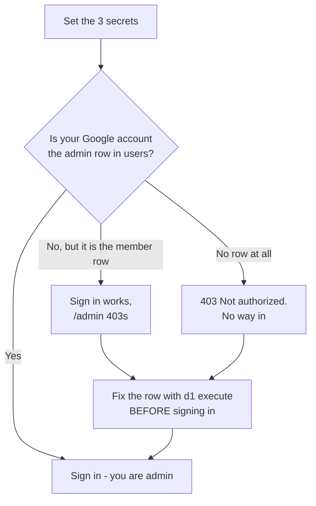

# Making authentication work

Working directory: `c:\code\home-dashboard`

This is the authoritative sequence. `local-testing.md` covers running the app; this covers getting
sign-in to actually function, locally and in production.

## Where things stand right now (verified, not assumed)

| Thing | State |
|---|---|
| `https://home-dashboard.app/` | Serves the frontend, **200** |
| Every `/api/*` route in production | **503** `Auth is not configured on the server` |
| `BETTER_AUTH_SECRET` (production) | **missing** |
| `GOOGLE_CLIENT_ID` / `GOOGLE_CLIENT_SECRET` (production) | **missing** |
| `INITIAL_ADMIN_EMAIL` (production) | set |
| `CLERK_SECRET_KEY`, `CLERK_WEBHOOK_SIGNING_SECRET` | still there, **dead** — Clerk is retired |
| `.dev.vars` `GOOGLE_CLIENT_ID` / `GOOGLE_CLIENT_SECRET` | empty |
| D1 migrations (remote) | all four applied, including `0004` |
| `users` table (remote) | **2 rows, both `active`** — one `admin`, one `member` |
| Better Auth `user` table (remote) | **0 rows** — nobody has ever signed in |
| Google OAuth client | exists; both redirect URIs saved and verified |
| Google consent screen | External; **publish it** — see step 2 |

So the deployed app is one step from working: three secrets. The 503 is the guard from PR #13 doing
its job, not a bug.

**The part that will bite you** is the second-to-last row. `authorize()` self-provisions
`INITIAL_ADMIN_EMAIL` as admin **only while `users` is empty**, and it is not empty. That safety
valve is already spent. So whichever Google account you sign in with must already have a row in
`users`, or you get `403` — and you cannot reach `/admin` to fix it, because `/admin` needs admin.

Check which two addresses those are before doing anything else:

```bash
npx wrangler d1 execute home-dashboard-db --remote --command "SELECT email, role, status FROM users;"
```



---

## Steps

### 1. Decide which Google account is the admin — do this first

Both existing rows are `active`, on different domains — which is why `authOptions.js` sets no `hd`
hosted-domain restriction.

**Already done:** the Gmail row has been promoted to `admin`, because the address the original
bootstrap row carries is not one that can authenticate through Google today. A `bootstrap` marker
proves an address was a valid identity under whatever auth was live at the time — not that it is a
usable Google account now, and that distinction is the difference between signing in and being
locked out with no route to `/admin`.

Note the shape of that change. `users.email` is the PRIMARY KEY, so renaming the old admin row to an
address that already exists fails on a UNIQUE violation — you promote the existing row instead:

```bash
npx wrangler d1 execute home-dashboard-db --remote \
  --command "UPDATE users SET role = 'admin' WHERE email = 'the-address@example.com';"
```

That leaves the original bootstrap row still holding `admin`. Decide what it should be — see the
query below and the note at the end of this step.

Look at the output of the query above.

- **If the `admin` row is an address you can sign in to with Google** (including Google Workspace on
  a custom domain), nothing to change. Skip to step 2.
- **If it isn't** — the account is gone, isn't a Google account, or you'd rather use a different one —
  fix the row now, before your first sign-in:

  ```bash
  # Point the existing admin row at the address you will actually use:
  npx wrangler d1 execute home-dashboard-db --remote \
    --command "UPDATE users SET email = 'you@gmail.com' WHERE role = 'admin';"
  ```

  Or add a second admin instead of moving the first:

  ```bash
  npx wrangler d1 execute home-dashboard-db --remote \
    --command "INSERT INTO users (email, role, status, invited_by) VALUES ('you@gmail.com', 'admin', 'active', 'manual');"
  ```

  Editing `users.role` by hand normally desynchronises Better Auth's own mirrored `user.role` and
  403s the admin API until `authorize()` repairs it. **Not a problem here** only because the `user`
  table is empty — the row is created at first sign-in with the correct role. If you ever do this
  again after people have signed in, expect one repair round-trip.

### 2. Make the consent screen let people through — this is a gate, not a formality

<https://console.cloud.google.com/apis/credentials> → the project for this app → **OAuth 2.0 Client
IDs**. If there is no client, create one: **Create Credentials → OAuth client ID → Web application**.

Then open **Audience**. An **External** app in **Testing** rejects *every* account that is not on its
**Test users** list — and it does so at Google's end, before the callback ever reaches the Worker.
An empty list means nobody can sign in, no matter how correct everything else is.

The failure mode is why this deserves its own step: you get a Google-side **`access_denied`**. Not
`redirect_uri_mismatch`, and not the app's Polish "Tego konta nie ma na liście domowników" message —
so it is easy to misdiagnose against the table at the bottom of this file.

Two ways out. **Publish the app** (Audience → **Publish app**, status becomes *In production*):

- No verification review is required, because the only scopes requested are `openid email profile`,
  all non-sensitive. `worker/authOptions.js` sets no custom `scope`.
- Nothing to maintain: no test-user list, no 100-account cap, and none of Testing mode's 7-day
  refresh-token expiry.
- **It does not widen access.** Anyone may reach Google's consent screen, but `databaseHooks.user
  .create.before` throws for any email without a `users` row and `authorize()` refuses it. The
  `users` table is the authorization boundary — that is the whole point of ADR 0009. Google proving
  who someone is has never been the same as letting them in.
- Reversible: you can return to Testing at any time.

Or **stay in Testing** and add every household address under **Test users**. Workable, but it makes
inviting somebody a *two-step* operation forever — a `users` row via `/admin`, **and** a test-user
entry here. Forget the second and the invitee hits `access_denied` with nothing in the app's logs to
explain it.

Get the addresses that need to work from the query in step 1.

### 3. Add both redirect URIs to that client

Under **Authorized redirect URIs**, add both, exactly:

```
https://home-dashboard.app/api/auth/callback/google
http://localhost:8787/api/auth/callback/google
```

One client serves production and local development on purpose — there is no separate development
instance to keep in step (ADR 0009).

Three ways to get this wrong, all of which surface as `redirect_uri_mismatch` at step 7 rather than
now:

- the path must be `/api/auth/callback/google` — not `/callback`, not `/api/callback`;
- `localhost`, **not** `127.0.0.1` — Google treats them as different origins, and `BASE_URL` says
  `localhost`;
- `https` for production, `http` for localhost.

Google can take a few minutes to propagate a change here.

### 4. Set the three production secrets

Each command prompts, so nothing lands in your shell history or in this repo (ADR 0005).

```bash
# 32 random bytes. This also encrypts data, not just cookies — generate a NEW one,
# do not reuse the local value, and do not rotate it casually later.
openssl rand -base64 32
npx wrangler secret put BETTER_AUTH_SECRET

npx wrangler secret put GOOGLE_CLIENT_ID
npx wrangler secret put GOOGLE_CLIENT_SECRET
```

`BETTER_AUTH_SECRET` is the one value here that nobody needs to *know* — it only has to be random
and stable. So it can be generated straight into wrangler without ever being displayed, copied, or
passing through a chat window:

```bash
node -e "console.log(require('crypto').randomBytes(32).toString('base64'))" \
  | npx wrangler secret put BETTER_AUTH_SECRET
```

The two Google values are different: they exist in the Cloud Console and have to be carried across
by a human. Use the prompting form for those.

Then remove the two dead Clerk secrets:

```bash
npx wrangler secret delete CLERK_SECRET_KEY
npx wrangler secret delete CLERK_WEBHOOK_SIGNING_SECRET
```

Confirm the result — you want exactly four names:

```bash
npx wrangler secret list
```

`BETTER_AUTH_SECRET`, `GOOGLE_CLIENT_ID`, `GOOGLE_CLIENT_SECRET`, `INITIAL_ADMIN_EMAIL`.

### 5. Fill in `.dev.vars` for local work

`BASE_URL`, `BETTER_AUTH_SECRET` and `INITIAL_ADMIN_EMAIL` are already filled. Add the two empty
lines using the **same** client as production:

```
GOOGLE_CLIENT_ID=<the Client ID>
GOOGLE_CLIENT_SECRET=<the Client secret>
```

The file is gitignored (`.gitignore:5`). Use a *different* `BETTER_AUTH_SECRET` locally than in
production — it is already generated, leave it as it is.

### 6. Deploy — the ordering matters

Secrets first, code second. Merging PR #14 deploys automatically (ADR 0007: tests → build →
migrations → `wrangler deploy`), so **do not merge before step 4 is done**, or the deploy lands
ahead of its configuration again and you are back to a 503.

Production's schema is already ahead of production's code: migration `0004` has been applied but the
recurrence code that reads those columns is still only on the branch. That is safe — `0004` is
additive and the live Worker never touches the new columns — but it does mean the migration step of
the deploy will be a no-op, and that is expected rather than a sign something went wrong.

### 7. Verify, in this order

```bash
# Should now be 401 (no session yet) instead of 503 (not configured):
curl -s -o /dev/null -w "%{http_code}\n" https://home-dashboard.app/api/whoami
```

- `503` → a secret is still missing. `npx wrangler tail` prints exactly which key names.
- `401` → configuration is good. Now open <https://home-dashboard.app/> and sign in with the account
  from step 1.

After signing in:

```bash
# Better Auth should now have exactly one identity, and its role should
# match the users row rather than being null:
npx wrangler d1 execute home-dashboard-db --remote --command "SELECT email, role, banned FROM user;"
npx wrangler d1 execute home-dashboard-db --remote --command "SELECT email, role, status FROM users;"
```

Then confirm `/admin` loads and lists both people. If it renders but the API 403s, the two `role`
columns disagree — reload once; `authorize()` repairs it on the way through.

Local: `npm run dev:worker`, open <http://localhost:8787>, sign in the same way. (`npm run
dev-no-auth` skips sign-in entirely and therefore proves nothing about any of this.)

## If something fails

**`503 Auth is not configured`** — a required key is unset. `npx wrangler tail` names them; the list
is `REQUIRED_AUTH_ENV` in `worker/authOptions.js`.

**`access_denied` from Google, before you ever get back to the app** — step 2. The consent screen is
still in **Testing** and the account isn't on the **Test users** list. This one never reaches the
Worker, so `wrangler tail` shows nothing at all; that silence is the tell.

**`redirect_uri_mismatch`** — step 3. Check the path, `localhost` vs `127.0.0.1`, `http` vs `https`,
and give Google a few minutes.

**"Tego konta nie ma na liście domowników."** — the invite gate refused: no `users` row for that
address, and the bootstrap cannot fire because the table is not empty. Go back to step 1.

**`403 Not authorized — ask an admin to invite you`** — there is a row, but `status` is not `active`.
Check with the query in step 1.

**Sign-in button does nothing** — shouldn't happen any more; PR #13 surfaces the failure in the UI
and logs the cause. `npx wrangler tail` while you click.

**Anything else** — send back the failing URL, the HTTP status, and the last ~20 lines of
`npx wrangler tail`.
